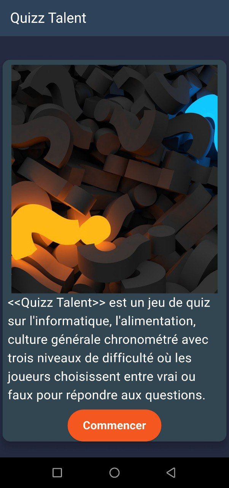
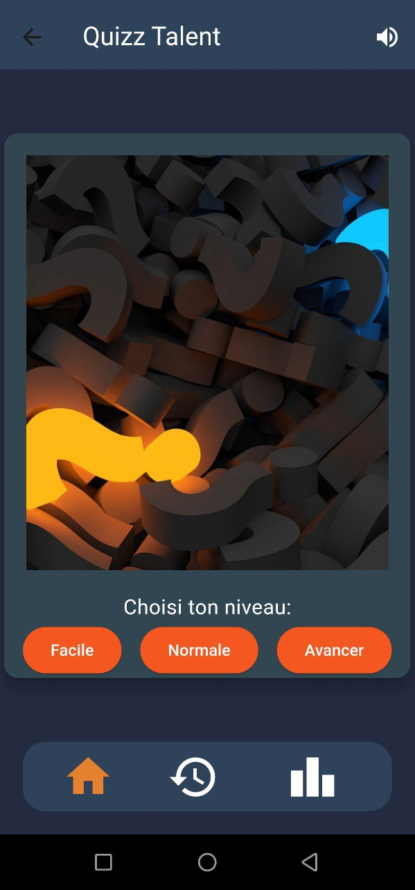
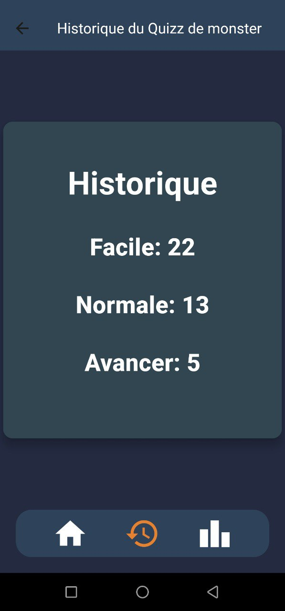

<h1>QUIZZ TALENT</h1>

<h3>Description</h3>

QuizTalent est un jeu de quiz de culture générale qui teste vos connaissances dans divers domaines tels que l'histoire, la science, la géographie, la littérature et bien plus encore. Avec une interface conviviale et des questions stimulantes, QuizTalent est parfait pour tester vos connaissances ou simplement vous divertir.
Fonctionnalités

## Captures d'écran

<h3>Page d'acceuil</h3>

<h3>Page des niveaux du jeux</h3>

<h3>Page d'historique</h3>

<h3>Licence</h3>

Ce projet est sous licence MIT - voir le fichier <a href="LICENSE">LICENSE</a> pour plus de détails.
